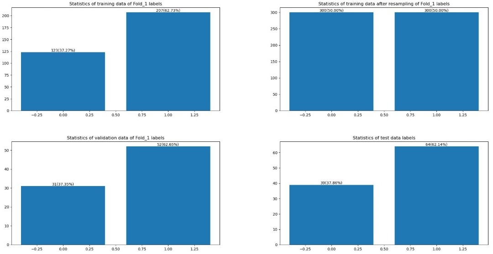
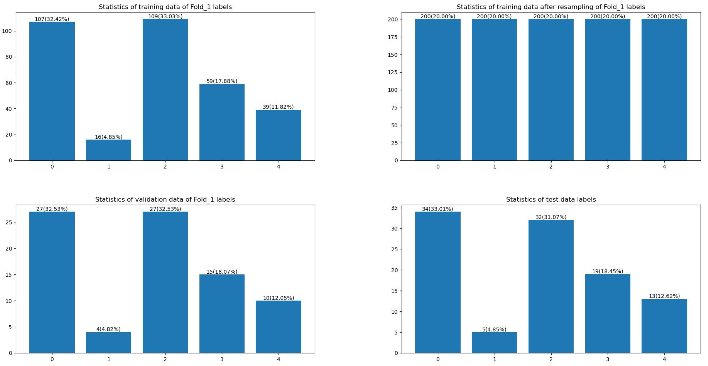
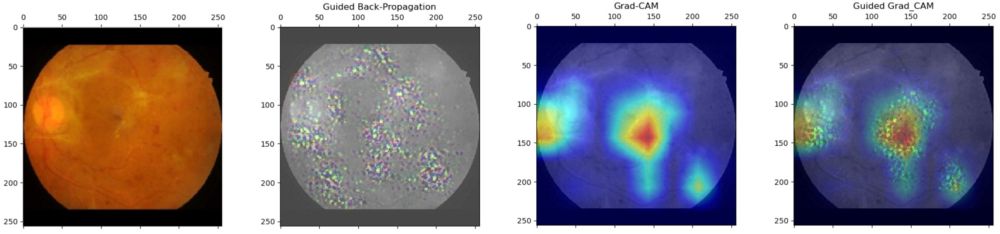

# Diabetic retinopathy recognition #

## Preparations
Before beginning with the process, we should choose the model and run mode.
<pre>
flags.DEFINE_string('model_id', 'B1', 'Choose your model from the Model index.')
</pre>
Following network architectures are available:
<pre>
Model_index = {'18': 'ResNet18', 
'34': 'ResNet34',  '50': 'ResNet50', '101':'ResNet101', '152': 'ResNet152',
'121': 'DenseNet121', '169': 'DenseNet169', '201': 'DenseNet201', '264': 'DenseNet264',
'IRV2': 'InceptionResnetV2', 
'IV3': 'InceptionV3',
'B2': 'EfficientNetB2', 'B1': 'EfficientNetB1', 'B0': 'EfficientNetB0',
'M2': 'MobilenetV2',
'16': 'vision_transformer_16'}
</pre>
Note that the training of ___DenseNet169, InceptionResnetV2, InceptionV3, EfficientNetB2, EfficientNetB1, EfficientNetB0, MobilenetV2, vision_transformer_16___ are transfer learning of pretrained models with ___ImageNet-21K___.

Then we shall specify the running mode:
<pre>
flags.DEFINE_string('Mode', 'Wandb', 'Specify mode from: Train, Evaluate, Tune/Wandb, Ensemble or Kaggle.')
</pre>
In ```config.gin``` we can set the configurable parameters. In the following modes you can find  detailed explanations of corresponding configurable parameters. 
#### Statistics of raw data:


## Train
There's two kinds of training process can be chosen, namely normal training process and k-fold training process. You can simply set ```KFOLD=True``` in ```main.py``` to start training process of k-fold.

Since the ```input_pipeline.file_extraction.load_file_names``` is a generator of k-fold indexes of each dataset for __k__ iterations, the normal training process only trains the first round of iteration but otherwise all __k__ iterations will be run out in k-fold training process

all the k-fold and resampling of dataset based on stratified sampling (```sklearn.model_selection.StratifiedKFold```) strategy according to the class label to ensure the balance between classes.

Following are the important configurations for training in ```config.gin```:
<pre>
Graham = False # whether to use self-build Graham process

num_classes = 2 # 1 for regression; 2 for binary classification ; 5 for multi(5-)class classification

batch_size = 30 # batch size

Trainer.N_epochs = 1000

Trainer.num_classes=%num_classes

Trainer.lr = 2e-4 # learning rate

Trainer.Ckpts = True # whether to record checkpoint


load_file_names.num_sample = 700
# size of training set after resampling. Each class will be num_sample/num_classes

fold_number=5
# choose how many folds will be set on the raw dataset
# in normal train process it means 20% of the raw dataset will be split out as validation dataset
</pre>
There's also some of the parameters who dealing with Tensorboard or ___Weights & Biases___. Sometimes when we save and upload the data will cost large amount of capacity in RAM, so they could be shut down here. The Profiler is higly recommanded to be closed because it always takes great capacity of CPU which causes out of memory especially in ```Kaggle``` mode.
<pre>
Trainer.Wandb=True # upload data to the Wandb or not

Trainer.Wandb_Foto= True # upload the recorded pictures to the Wandb or not, which can save the disk capacity if closed

Trainer.Profiler = False 
# whether to record the profiler. Highly recommended to be closed to save RAM especially for training on Kaggle dataset
</pre>

Note that if the following parameter, which is used in ```Evaluate``` mode, can also restore the checkpoint from previous training process if the model name in this parameter corresponds to the chosen model name in ```main.py```. 
<pre>
ckpt_fn="run_best_EfficientNetB2(G)"
# Specify which checkpoint file in the experiments will be evaluated
</pre>
Since if the previous training step is stopped by accident, by configuring ```ckpt_fn``` can continue the training process when the codes were run again. 

#### Statistics of input data for 2-class classification:

#### Statistics of input data for 5-class classification:

#### Preprocessing example :

*original image, image after cropping and padding and image after self-build Graham preprocessing

#### Input data after augmentation (random shearing, rotation, resizing, cropping, photometric changes etc.):

#### Input data after self-build Graham preprocessing:


After training the model will be evaluated by the confusion metrics. If we want a detailed evaluation both in confusion metrics and deep visualisation, please tend to the ```Evaluate``` mode. 

## Evaluate
In this mode the pretrained models can be evaluated by the confusion metrics and deep visualisation. The checkpoints which were already built by the training steps will be restored to the corresponding model. Here you can specify which checkpoint file in the experiments will be evaluated and which picture in the test dataset will be deep visualized as example in ```config.gin``` as follows:
<pre>
ckpt_fn="run_best_EfficientNetB2(G)"
# Specify which checkpoint file in the experiments will be evaluated
</pre>
As was mentioned in the last mode, ```ckpt_fn``` can also be utilized during the ```Train``` mode, to continue the training of the corresponding model if the model selected in ```main.py``` is same as it.

Unfortunately, ```Evaluate``` mode does not support k-fold experiment process file. However, the evaluation with confusion matrix of each fold has been already done in the training process. 

If we want to evaluate a specific run in k-fold, one way is to put the checkpoint files of this run out of the corresponding fold directory in the checkpoint directory for all k runs, so that it can be read by the codes.
<pre>
Visualisation.image_id = "IDRiD_054.jpg"
# choose which picture will be used to show the deep visualisation
</pre>
Note that even if the model selected by the  ```main.py``` is different from the model for the checkpoint, it has lower priority than the model name which is found in the ```ckpt_fn``` of the configuration. To use the self-build Graham preprocessed test set to evaluate the model which is trained in this type of train set the ```(G)``` in filename shall also be recognizable.
## Tune
In this Mode you can tune the ViT-16 Model with 5-class classification using ```tensorboard.plugins.hparams```
## Wandb
In this Mode you can tune the ViT-16 Model with 5-class classification using ```wandb.sweep```, which is more advanced than using tensorboard and recommended.
## Ensemble
Here you can type in the checkpoint filenames of the models you've trained to do the ensemble learning. All these checkpoints will be restored to the corresponding model structures and do the ensemble learning (such as voting):
<pre>
ckpt_fns=['run_best_EfficientNetB2' ,'run_best_MobilenetV2','run_best_ResNet50','run_best_DenseNet121','run_best_InceptionV3']
# Specify which checkpoint files will be used in ensemble learning.
</pre>
if the type of parameter is not a list but string, the ensemble learning will be done on a k_fold experiment record like following:
<pre>
ckpt_fns='run_2021.12.22_T_12-33-04ResNet18_10-Fold'
</pre>
## Kaggle
Here you can use the training system to train the models on Kaggle challenge dataset. Since the configurations are much more different from the one used before, another gin file is build for it, namely ```config_Kaggle.gin```

## Results

#### Results of different models for binary classification:
### Binary classification
The best accuracy on test set could be 87.37%(Ensemble model)
|architecture|Sensitivity |Specificity |Precision | Accuracy |  Balanced-accuracy |   F1 score |
| :---: | :---: | :---: | :---: | :---: | :---: | :---: |
| ResNet18 |78.12%|94.87%|96.15%|84.46%|86.49%|86.21%|
| ResNet34 |79.69%|92.31%|94.44%|84.46%|85.00%|86.44%
|ResNet50|79.69%|97.44%|98.08%|86.40%|88.55%|87.93%
| MobileNetV2 | 76.56%|92.31%|94.23%|82.52%|84.44%|84.48%|
| InceptionV3 |84.38%|84.62%|90.00%|84.47%|84.50%|87.10%|
| InceptionResNetV2 |76.56%|92.31%|94.23%|82.52%|84.44%|84.48%|
| DenseNet121 |84.38%|79.49%|87.10%|82.51%|81.92%|85.71%|
|DenseNet169|78.12%|92.31%|94.34%|83.49%|85.21%|85.47%|
|EfficientNetB0|79.69%|82.05%|87.93%|80.58%|80.87%|83.61%
|EfficientNetB1|78.12%|87.18%|90.91%|81.55%|82.65%|84.03%|
|EfficientNetB2|82.81%|84.62%|89.83%|83.50%|83.71%|86.18%|
| ViT-16 |  82.81%|89.74%| 92.98%|85.43%|86.27%|87.60%
| Voting |84.38%|92.31%|94.74%|__87.37%__|88.33%|89.26%
---
#### Comparisions of different models with self build __Graham preprocessing__ for binary classification:
|architecture|Sensitivity |Specificity |Precision | Accuracy |  Balanced-accuracy |   F1 score |Graham preprocessing|
| :---: | :---: | :---: | :---: | :---: | :---: | :---: | :---: |
| ResNet34 |79.69%|92.31%|94.44%|84.46%|85.00%|86.44%|X|
|ResNet34|87.50%|84.62%|90.32%|86.41%|86.06%|88.89%|√|
---
|architecture|Sensitivity |Specificity |Precision | Accuracy |  Balanced-accuracy |   F1 score |Graham preprocessing|
| :---: | :---: | :---: | :---: | :---: | :---: | :---: | :---: |
| MobileNetV2 | 76.56%|92.31%|94.23%|82.52%|84.44%|84.48%|X|
| MobileNetV2 |87.50%|79.49%|87.50%|84.47%|83.49%|87.50%|√|
---
|architecture|Sensitivity |Specificity |Precision | Accuracy |  Balanced-accuracy |   F1 score |Graham preprocessing|
| :---: | :---: | :---: | :---: | :---: | :---: | :---: | :---: |
|EfficientNetB2|82.81%|84.62%|89.83%|83.50%|83.71%|86.18%|X|
| EfficientNetB2 |81.25%|89.74%|92.86%|84.47%| 85.50%|86.67%|√|
---
|architecture|Sensitivity |Specificity |Precision | Accuracy |  Balanced-accuracy |   F1 score |Graham preprocessing|
| :---: | :---: | :---: | :---: | :---: | :---: | :---: | :---: |
| ViT-16 |  82.81%|89.74%| 92.98%|85.43%|86.27%|87.60%|X|
| ViT-16 | 79.69%|97.44%|98.08%|86.41%|88.56%|87.93%|√|
---
Deep visualization example (ResNet50):


### Multi-class classification (based on Vision transformer 16)
#### Best 5 Hyperparameter configurations on vision transformer 16 on multi-class classification task after tuning with ___Weights & Biases___:
| optimizer | dropout rate* | learning rate | weight decay | validation accuracy|
| :---: | :---: | :---: | :---: | :---: |
| Adam | 0.0 | 1.6e-3 | 2.4-4 | 61.17% |
| SGD | 0.1 | 1.6e-2* | 5e-4 | 60.19% |
| Adam | 0.1 | 1.1e-3 | 3.1e-4 | 60.19% |
| Adam | 0.2 | 1.5e-3 | 2.1e-4 | 60.19% |

*SGD learning rate is the maximum learning rate of the self-build cosine annealing with warm up

*dropout rate is the maximum rate of the linearly increasing dropout rates of Transformer-encoder blockes
#### Best result of 5-class classification of vision transformer 16:
| class against all |Sensitivity |Specificity |Precision | Accuracy |  Balanced-accuracy |F1 score |
| :---: | :---: | :---: | :---: | :---: | :---: | :---: |
|0 | 88.24%|81.16%| 69.77%|83.50%| 84.70%|77.92%|
|1|0.00%|97.96%| 0.00%|93.20%|48.98%|0.00%|
|2|68.75%|74.65%|55.00%|72.82%|71.70%|61.11%|
|3 | 42.11%|92.86%|57.14%|83.50%|67.48%|48.48%|
|4 | 23.08%|98.89%|75.00%|89.32%|60.98%|35.29%|
|Total| |||__61.17%__|44.43%|

#### Confusion matrix of multi-class classification example (vision transformer 16):


#### [Tuning report of vision transformer 16 of 5-class classification with wandb](https://wandb.ai/yitianshi/HP_VIT16/reports/Parameter-tuning-for-vision-transformer-16--VmlldzoxMzg1MTE2?accessToken=190u61bscs0ibklkhgt1c25f4h6s8oqhqm0ucq1q43wahcfhqepliktiascpvbmc)


