# Human Activity Recognition #

## Preparations
Before beginning with the process, we choose the dataset, model and run mode.
<pre>
flags.DEFINE_string('source_data', 'HAR', 'Original Dataset-Source HAPT/HAR')
flags.DEFINE_string('model_index', '1', 'Choose your model from the Model index.')
flags.DEFINE_string('Mode', 'Train', 'Specify whether to Train or Evaluate a model.')
flags.DEFINE_boolean('wandb', True, 'Specify whether to use wandb')
</pre>

<u> Datasets </u>

 - Human Activities and Postural Transitions (HAPT)
	- 3 accelerometer & 3 gyroscope sensor values -> in total 6 channels
	- 12 labled activities
- Human Activity Recognition (HAR)
	- 7 devices with each 3 accelerometer & 3 gyroscope sensor values -> in total 42 channels
	- 8 labled activities


Following <u>models</u> are available:
<pre>
Model_index = { '1': 'RNN',
		'2': 'Stacked_RNN'
		}
</pre>

In the corresponding gin config file the configurable parameters can be set.

|                          |parameter|```config_HAPT.gin```| ```config_HAR.gin```| description|
|:------------------------:| :---: | :---: | :---: | :---: |
| |
| <sup>Data Handling</sup> | WINDOW_SIZE | ~ 150 - 350| ~ 150 - 350 | defines the datapoints used for one time-series|
|                          | WINDOW_SHIFT_RATIO| 0.1 - 1 | 0.1 - 1 | WINDOW_SIZE*WINDOW_SHIFT_RATIO = shift of the window on the dataset
|                          |    LABELING_THRESHOLD    | 0.5 - 1.0| - | Sequence to Label: Occurence of one single lable must exceed the threshold to assign this label to this window
|                          |     SELECTED_CLASSES     | 1-6: continuous activities (much more samples) 7-12: transitionals| well balanced data - no transitions | adjust dataset to use whole dataset or just continuous activities
|                          |     SELECTED_SENSORS     | just one device located at waist |chest, forearm, head, shin, thigh, upperarm, waist| choose sensor-values to include in dataset !Warning: in two files are no values of the forearm-sensors (train5_climbingup & train_2_climbingup)!
||
|     <sup>Model</sup>     | DROPOUT_RATE| 0 - 0.9 | 0 - 0.9 | 0 = no dropout layer
|                          |        LSTM_UNITS        | ~ 3 - 20| ~ 3 - 20 (tuple) | Amount of LSTM-Cells
||
|   <sup>Training</sup>    | LEARNING_RATE| 0.1 - 0.0001 | 0.1 - 0.0001 | learning rate during training

## Data Handling
Following steps are performed on the raw data
1) Z-Score Normalization on each sensor channel of each measurment file to remove user dependent biases and offsets.
2) Sliding  Window Technique to gain fixed-length input sequences
	 - HAPT: predominant lable will be assigned to window (see LABELING_THRESHOLD)
	 - HAR: raw data is already split into time-series with single lable
3) Split into Train, Validation, Test dataset (roughly 70, 10, 20%)
4) Oversampling
5) Saved as TFRecord files

This Process can take from 15 minutes (HAPT) to several hours (HAR). That's why these TFRecords are stored on the hard-drive and read from if available.

#### Sliding Window Visualization:
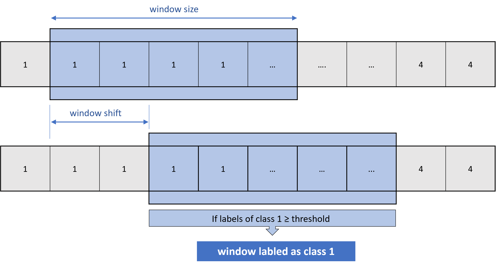
- _<u>Addition:</u> Special Treatment of Transitions in HAPT-Dataset (class 7-12)\
The dataset contains only few samples of transitional activities. These are also often only of short period. Therefore these activities are prioritized while using the sliding window techniques. If inside the window one transitional activity is in between (framed by) two continuous activities the window is labeld by the transitional class._


## Train
Following are the important configurations for training in ```config_HAPT.gin```/```config_HAR.gin```:
<pre>
N_EPOCHS = 1000
BUFFER_SIZE = 200
BATCH_SIZE = 20

input_shape = (%WINDOW_SIZE, %SENSOR_CHANNELS)
</pre>


## Statistics
#### Statistics of windowed data:

The HAPT dataset is highly imbalanced. There are especially very few samples for the transitional activities (class 7-12) 
The class distribution also differs from train, validation and test set. You get further variations by adjusting the input-methods (window-size, shift ratio etc.) as seen in these two exemplary diagrams. 

HAPT - window_size = 250             |                                HAPT - window_size = 300                                |
:-------------------------:|:--------------------------------------------------------------------------------------:
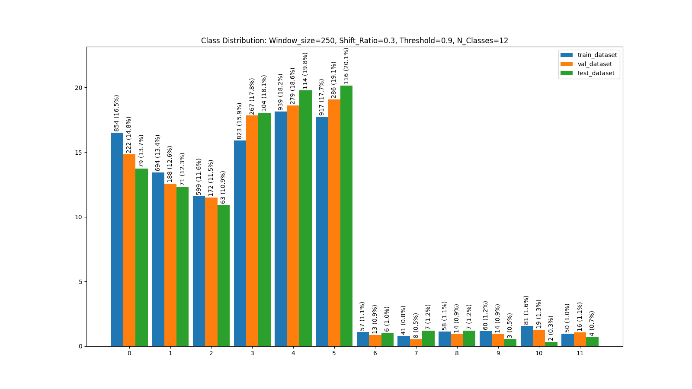  | 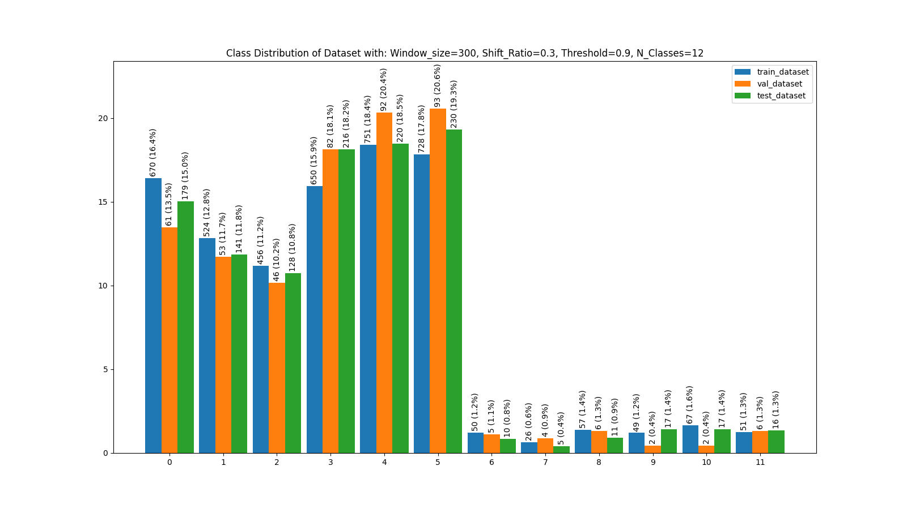 


###
#### Random samples of each class from the HAPT dataset:
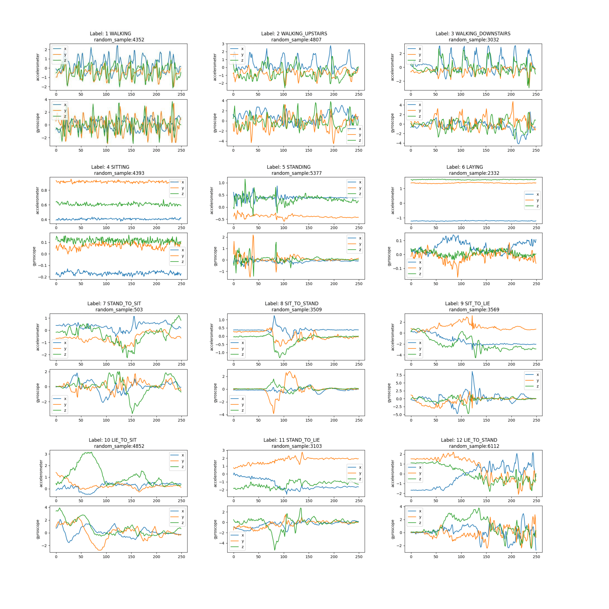
###
#### Random samples of each class from the HAR dataset: 
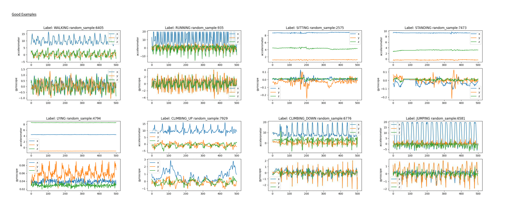

Unlike the HAPT dataset the activities are not as time-precisely labled. Therefore you also get windows that differ a lot from other windows of the same activity. Some examples are displayed in the following charts.
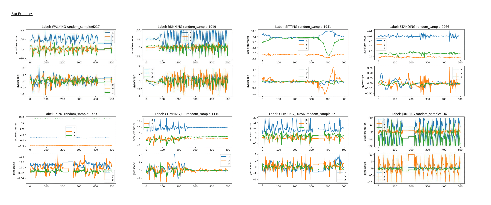


## Results

#### Results of different models for HAPT-Dataset 12 activities-classification:

The best accuracy on the test set could be achieved with 88.90 % by using  model RNN-11. The Model structures are displayed in details after following table.
The best results could be achieved with window sizes of 250 and 300 data points. Which corresponds to time intervals of 5 and 6 seconds.

| Window Size|Architecture|Sensitivity |Specificity |Precision | Balanced Accuracy |  Balanced-Error-Rate|   F1 score |
| :---: | :---: | :---: | :---: | :---: | :---: | :---: | :---: |
| 300 | RNN-11|88.90%|98.99%|89.74%|88.90%|11.10%|89.00%|
| 300 | Stacked-RNN-10-10|88.77%|98.98%|90.86%|88.77%|11.23%|88.63%|
| |
| 250 | RNN-13| | | |86.95%| | |
| 250 | Stacked-RNN-11-11| | | |91.62%| | |


#### RNN-Models in detail:

|Model | Layer | Output Shape | Parameters | Characteristics|
| :---: | :---: | :---: | :---: | :---: |
||
|RNN-11| Input-Layer| [(300, 6)] | -
| | Dropout-Layer| [(300, 6)] | - | 10% dropout rate
| | LSTM-Layer| [(11)] |  792 | 11 Units
| | Dense-Layer| [(12)] |  144 |
| | Output-Layer| [(12)] |  - | Softmax
||
|RNN-13| Input-Layer| [(250, 6)] | -
| | Dropout-Layer| [(250, 6)] | - | 40% dropout rate
| | LSTM-Layer| [(13)] |  988 | 13 Units
| | Dense-Layer| [(12)] |  168 |
| | Output-Layer| [(12)] |  - | Softmax

#### Stacked-RNN-Models in detail:
|Model | Layer | Output Shape | Parameters | Characteristics|
| :---: | :---: | :---: | :---: | :---: |
||
|Stacked-RNN-10-10| Input-Layer| [(300, 6)] | -
| | Dropout-Layer| [(300, 6)] | - | 10% dropout rate
| | LSTM-Layer| [(300, 10)] |  640 | 10 Units, return sequence active 
| | LSTM-Layer| [(10)] |  840 | 10 LSTM-Units
| | Dense-Layer| [(12)] |  132 |
| | Output-Layer| [(12)] |  - | Softmax
||
|Stacked-RNN-11-11| Input-Layer| [(300, 6)] | -
| | Dropout-Layer| [(250, 6)] | - | 10% dropout rate
| | LSTM-Layer| [(250, 11)] |  792 | 11 Units, return sequence active 
| | LSTM-Layer| [(11)] |  1012 | 11 LSTM-Units
| | Dense-Layer| [(12)] |  132 |
| | Output-Layer| [(12)] |  - | Softmax


### Soft-Voting
Combining the 4 best models by soft-voting gives a balanced accuracy of 91.44% for the test dataset.

| Window Size|Architecture|Dropout-Rate | Balanced Accuracy|
| :---: | :---: | :---: | :---: |
| 250 | RNN-13 | 40% | 86.92% |
| 250 | Stacked-RNN-11-11| 10% | 91.4%|
| 250 | Stacked-RNN-8-11| 50% | 84.5%|
| 250 | Stacked-RNN-15-12| 30%| 88.5%|


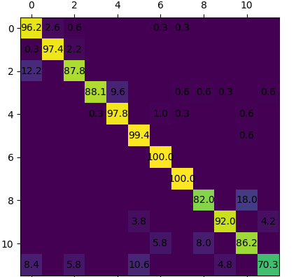

### Transformer Encoder:
We also built and configure a transformer-encoder to  carry out this task.
According to the hyperparameter based on the Transformer base model presented by '_Attention is all you need_' we have the following changes to adapt to our classification task:

First, only the Encoder part is needed as the backbone of our model. 
Instead of Word2Vec embedding we use a simple 1D convolution to increase the number of channels to the dimension of encoder input. 
Meanwhile, the positional encoding still follows the structure in the paper.
Second, we add a series of pooling, dropout and dense layer, just like the head part of RNN structure, as the head part of our model. 
Third, we have the following configurations compare to the model structure from base model in the paper:


|                   Model                   | num_layers | d_model | d_feed_forward | num_head | d_key | d_value |
|:-----------------------------------------:|:----------:|:-------:|:--------------:|:--------:|:-----:|:-------:|
| Base Transformer model <br/> in the paper |     6      |   512   |   2048    |    8     |  64   |   64    |
|                 Our model                 |     1      |   32    |    128    |    4     |   8   |    8    |

This hyperparameter configuration achieves the best accuracy after tuning. The results are as follows:

|  class against all   | sensitivity | specificity | precision |  accuracy  | balanced_accuracy | F1-score |
|:--------------------:|:-----------:|:-----------:|:---------:|:----------:|:-----------------:|:--------:|
|       walking        |   100.00%   |   96.88%    |  64.82%   |   97.04%   |      98.43%       |  78.66%  |
|   walking upstairs   |   92.77%    |   99.21%    |  91.30%   |   98.67%   |      95.98%       |  92.03%  |
|  walking downstairs  |   95.37%    |   98.32%    |  81.42%   |   98.10%   |      96.84%       |  87.85%  |
|       sitting        |   96.35%    |   98.50%    |  83.40%   |   98.33%   |      97.41%       |  89.41%  |
|       standing       |   95.89%    |   98.46%    |  83.00%   |   98.27%   |      97.17%       |  88.98%  |
|        laying        |   98.40%    |   95.51%    |  48.62%   |   95.62%   |      96.94%       |  65.08%  |
|     stand to sit     |   89.78%    |   99.75%    |  97.23%   |   98.83%   |      94.75%       |  93.36%  |
|     sit to stand     |   83.72%    |   99.96%    |  99.60%   |   98.33%   |      91.83%       |  90.97%  |
|      sit to lie      |   85.65%    |   97.57%    |  73.12%   |   96.71%   |      91.60%       |  78.89%  |
|      lie to sit      |   83.45%    |   99.23%    |  91.70%   |   97.77%   |      91.33%       |  87.38%  |
|     stand to lie     |   45.10%    |   98.36%    |  83.13%   |   90.25%   |      71.72%       |  58.47%  |
|     lie to stand     |   72.33%    |   99.12%    |  90.04%   |   96.45%   |      85.72%       |  80.22%  |
| __Total evaluation__ |             |             |           | __82.25%__ |    __82.28%__     |          |

<p align="center">
  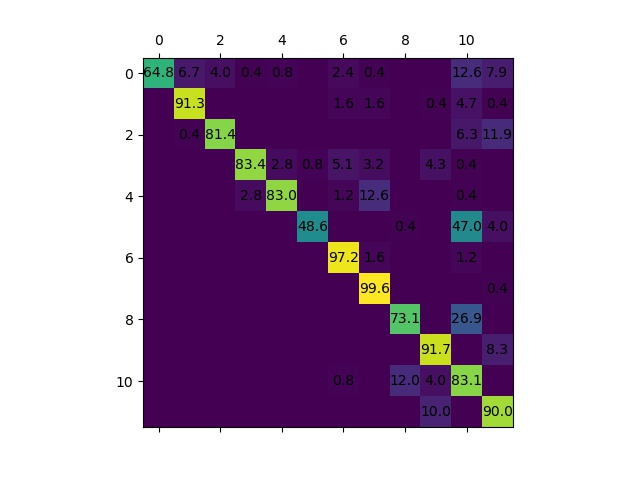
</p>
<p style="text-align: center;">
 Confusion matrix for Transformer encoder
</p>

### HAR-Dataset 8 activities-classification:
When dealing with the data preprocessing, 
the problem we were facing is to deal with the wrong alignment of the data.
This means since the data is recorded from the different sensors, 
they may have differences by few milliseconds in recorded time by real world situation.

The following table shows an example for the recording time of the sensors on the head for jumping activity.


| id  | attr_time of Gyroscope (milliseconds) | attr_time of accelerometer (milliseconds) | difference (milli-seconds) |
|:---:|:-------------------------------------:|:-----------------------------------------:|:--------------------------:|
|  1  |             1438189988408             |               1438189988408               |             0              |
|  2  |             1438189988422             |               1438189988423               |             1              |
 |  3  |             1438189988447             |               1438189988448               |             1              |
 |  4  |             1438189988465             |               1438189988465               |             0              |
|  5  |             1438189988485             |               1438189988486               |             1              |


In some cases, the start, end and even the length of time series from different sensors can differ from each other, 
which enhanced the difficulty to combine both sensor data together.
<p align="center" >
  
</p>
To solve this problem we choose to use the following method to preprocess the data: 

First, from the data recorded at the same time (same proband and activity), we find the earliest start and the latest end time point from different sensors, and define a discrete time range of those two time points with 20 ms step size

Second, for each data series we define an 1-D nearest Interpolation function using scipy, since we assume the data keeps same in 20 ms. The time point outside the original range will be extrapolated. 

Third, we apply the Interpolation functions from different sensors to this same time range from the first step. After all, the data from different sensors is aligned with each other.

### Results of HAR
We've tried different model architectures on different sensor positions. Some positions can present good accuracies on a specific position (one against others).

Following is the best results from specific sensor positions with the best model we've tried.

|    0    |    1    |    2    |    3     |   4   |      5      |       6       |    7    |
|:-------:|:-------:|:-------:|:--------:|:-----:|:-----------:|:-------------:|:-------:|
| walking | running | sitting | standing | lying | climbing up | climbing down | jumping |

<p align="center">
 Position: upperarm <br/>Model: stacked RNN (10,10) <br/>Total accuracy: 83.42%
</p>
<p align="center">
  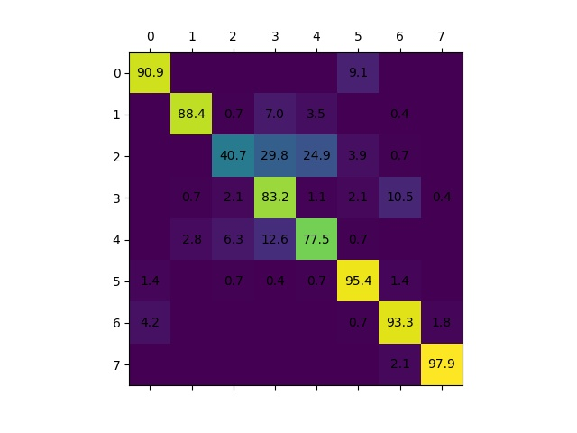

</p>

<p align="center">
 Position: chest <br/>Model: RNN 10 <br/> Total accuracy: 82.76%
</p>
<p align="center">
  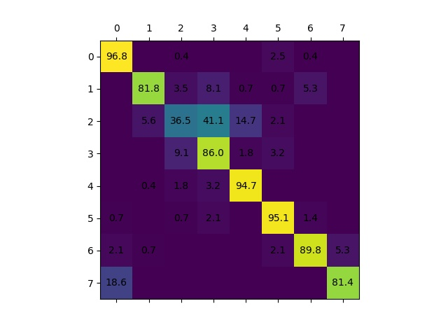
</p>

<p align="center">
 Position: shin <br/> Model: stacked RNN (10,10) <br/> Total accuracy: 81.84%
</p>
<p align="center">
  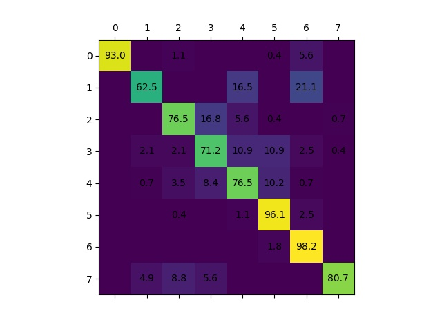
</p>

<p align="center">
 Position: waist <br/>Model: stacked RNN (10,10) <br/>Total accuracy: 75.44%
</p>
<p align="center">
  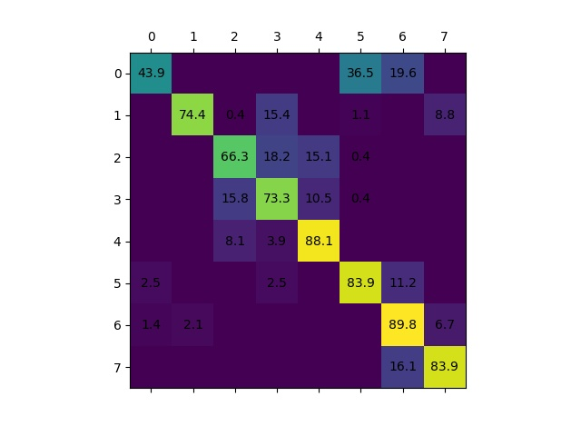
</p>

<p align="center">
 Position: forearm <br/>Model: stacked RNN (10,10) <br/>Total accuracy: 73.03%
</p>
<p align="center">
  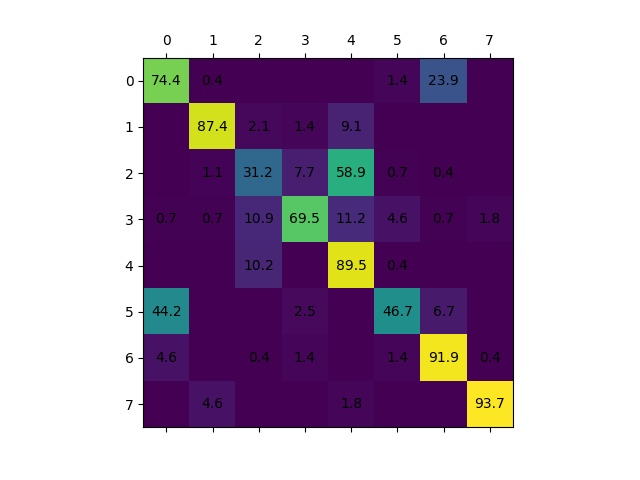
</p>

<p align="center">
 Position: head <br/>Model: stacked RNN (10,10) <br/>Total accuracy: 67.32%
</p>
<p align="center">
  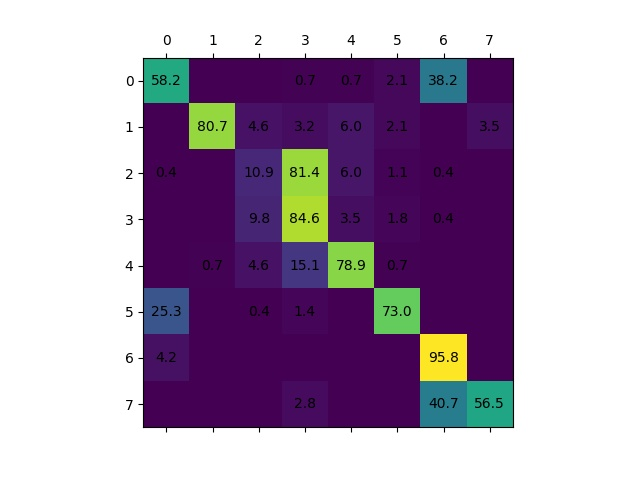
</p>

As we can see, the confusion between some classes like lying and sitting can be severe.

Meanwhile, some data even gives a big difference (upperarm over 30% e.g.) between the validation and test accuracy because of the different distribution of both datasets. 
One reason we assume is because of the variety of human physical characteristics. These results comparisons are as follows:

| sensor position | model architecture  | best validation accuracy | test accuracy | accuracy difference (validation - test) |
|:---------------:|:-------------------:|:------------------------:|:-------------:|:---------------------------------------:|
|    upperarm     | stacked RNN (10,10) |          49.40%          |    83.42%     |                 -34.02%                 |
|      waist      | stacked RNN (10,10) |          52.99%          |    75.44%     |                 -22.45%                 |
|      thigh      |       RNN 11        |          76.69%          |    56.32%     |                 20.37%                  |

